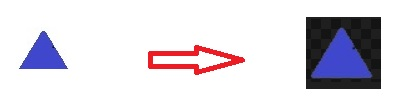

# Ako urobiť priehľadný resp. transparentný obrázok?

V dnešnej dobe máme už veľa aplikácii na výrobu transparentného obrázka. (Gimp, Adobe PhotoshopMP, Canva, Krita  atď.)

## Pomocou Pythonu:
    0) Pomocou modulu Pillow

    1) Najprv treba nainštalovať v cmd: pip install pillow

    2) Potom treba v kóde zadať vstupnú cetu k obrázku a výstupnu cestu k výstupnému obrázku.

    3) Spustiť upravený kód (zadané cesty)

    4) Pythonovský kód vytvorí nový priehľadný obrázok

